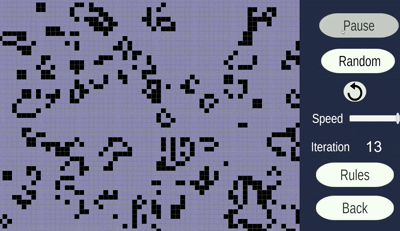

# cellular-life
A visual exploration of cellular automata built with Unity. This project implements three distinct automatas, allowing users to observe emergent complexity from simple rules.

## Cellular automata implemented:
* **Conway's Game of Life:** The classic zero-player game based on survival, overpopulation, and reproduction.
* **Langton's Ant:** A two-dimensional universal Turing machine with complex emergent behavior.
* **Seeds:** A cellular automaton creating beautiful, snowflake-like patterns.

## Technical Details
* **Engine:** Unity 
* **Language:** C#
* **❗Resolution:** Right now only works for **1920x1080**.
